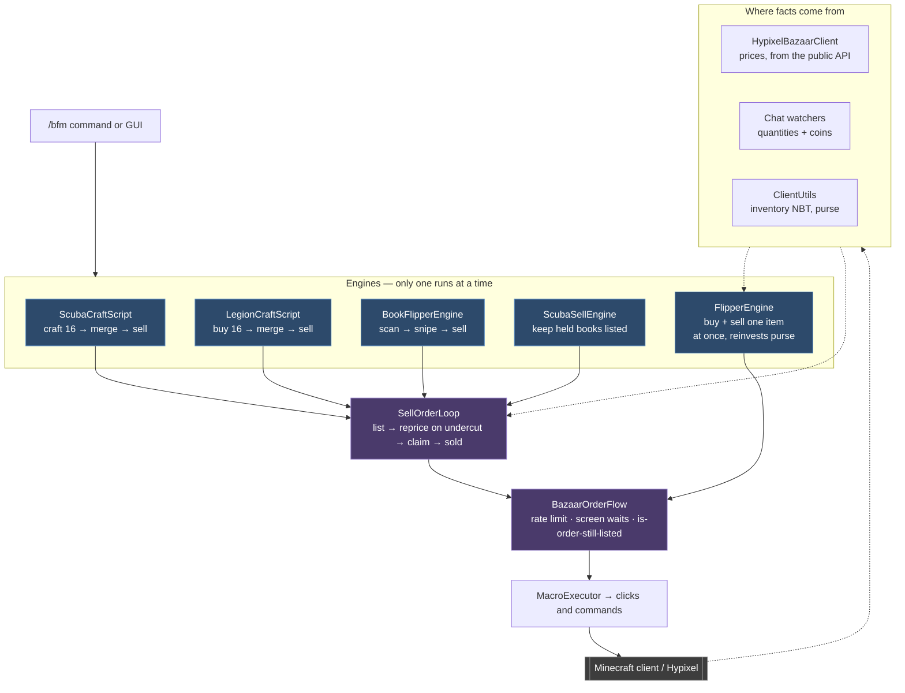
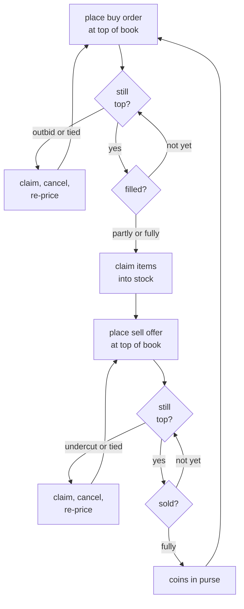

# Architecture

## Overall structure

`FlipperEngine` is the one engine that doesn't use `SellOrderLoop` — it runs a buy order and a sell
offer *concurrently* on the same item and tracks both sides itself. The other four are sequential,
so they share the loop.

Each engine's `start()` refuses to run while another is active, which is what makes it safe for
`BazaarOrderFlow` to hold a single rate-limit clock for all of them.

Omitted for clarity: `FlipperCoordinates`/`FlipperSettings` (JSON config feeding the click layer),
`BookSniperScanner` (picks Book Flipper's target), and `ErrorReporter` (every engine dumps to it on
failure).

## The flip cycle

What `FlipperEngine` actually does on repeat. The craft scripts are the same shape with a
craft-or-merge step where the buy order sits.

A price **tie** triggers a re-price just like being beaten does: Hypixel breaks ties by order
recency, so a same-priced order placed after ours fills first.

## Two rules the whole codebase follows

**Quantities and coins come only from Hypixel's own chat confirmations.** Never from a purse delta —
a purse increase can't be told apart from unrelated income (a talisman, a booster, a mob drop), and
wrongly crediting it could push a still-open order past its completion threshold and abandon it.

**Whether an order is *done* is read directly, not inferred.** The check is whether its slot in the
manage-orders (F6) menu still holds an item. Earlier versions inferred it from shared counters, and
concurrent buy/sell activity corrupted both sides' baselines.

## Where to edit

| To change… | Edit |
|---|---|
| How selling works, for every engine | `flipper/SellOrderLoop.java` |
| Rate limits, screen waits, retry counts | `flipper/BazaarOrderFlow.java` |
| The buy side / concurrent flip logic | `flipper/FlipperEngine.java` |
| Which click lands where | `flipper/FlipperCoordinates.java` (JSON-backed, no rebuild) |
| Price increments, tax rate, intervals | `flipper/FlipperSettings.java` |
| Which rare books qualify | `books/BookSniperScanner.java` |
| Add a new craft script | Copy a `craft/*Script.java`, hand `SellOrderLoop` a `Config` |
| Commands | `command/BfmCommandRegistrar.java` |

Crash reports land in `config/bazaarmacro/crash-logs/`; list them in-game with `/bfm errors`.
